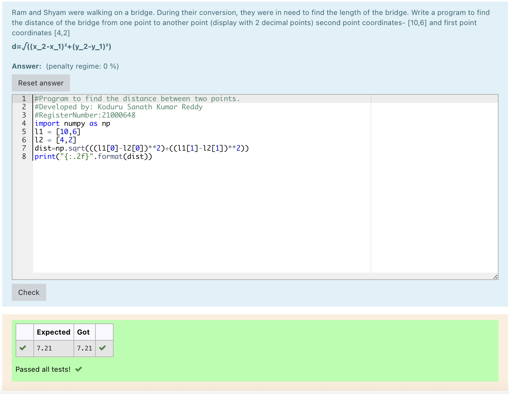

# DISTANCE-BETWEEN-TWO-POINTS

## AIM:
To write a python program to find the distance two 2 points
## ALGORITHM:
### Step 1: 
Import numpy
### Step 2: 
Assign l1=[10,6]
Assign l2=[4,2]
### Step 3: 
Substitute the values in the distance formula.
### Step 4: 
Process dist=np.sqrt(((l1[0]-l2[0])**2)+((l1[1]-l2[1])**2))
### Step 5: 
Display dist
### Step 6:
End the program
### PROGRAM:
~~~
#Program to find the distance between two points.
#Developed by: Koduru Sanath Kumar Reddy
#RegisterNumber:21000648
import numpy as np
l1 = [10,6] 
l2 = [4,2]
dist=np.sqrt(((l1[0]-l2[0])**2)+((l1[1]-l2[1])**2))
print("{:.2f}".format(dist))
~~~

### OUTPUT:

### RESULT:
Thus the distance between two points is calculated successfully.
